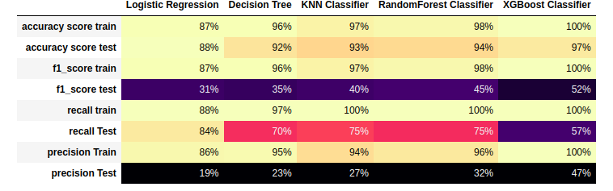

# Company Bankruptcy Prediction Machine Learning Project

## About
This project focuses on whether company will go bankruptcy or not. Knowing about the companies condition is always helpful for the investors. With the help of various parameters we can predict that company is in good condition.

### Dataset
* [Dataset](https://www.kaggle.com/datasets/fedesoriano/company-bankruptcy-prediction) link from kaggle.

### Models Report:

* Information about numerical features

### Imbalance target feature was balanced

### After applying SMOTE 

* Correlation Plot

* Outliers 

* Bivariate Analysis

KDEPlot to do scaling

### ML Models Used:
* Classification Models
     * Logistic Regression
     * Decision Tree Classifier
     * KNN Classifier
     * RandomForest Classifier
     * XGBoost Classifier

### Python Dependencies:
* pandas
* numpy
* pickle
* matplotlib
* statsmodels
* seaborn
* sklearn
* django

### Install Dependencies (requirements.txt)
1. pip install -r requirements.txt
